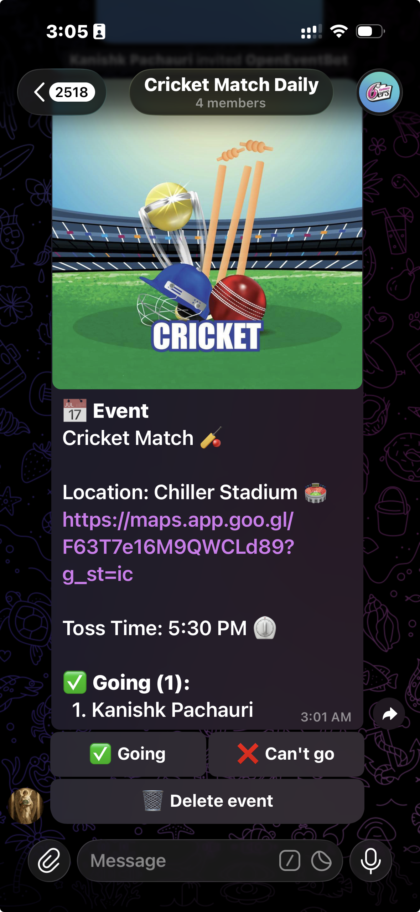

<p align="center">
  <a href="https://t.me/opentgytbot">
    
  </a>
</p>

# OpenEvent_bot

A Telegram bot for creating events in groups with RSVP support. Group members can RSVP with a single tap — no more "I'm in" spam in the chat.



## Features

- Create events with `/event <description>`
- RSVP with inline buttons (Going / Can't go)
- Live attendee list updated in real time
- Markdown support in event descriptions
- SQLite-backed persistence
- Fully in English

## Setup

### Prerequisites

- Python 3.12+
- [uv](https://docs.astral.sh/uv/) (Python package manager)
- A Telegram bot token from [@BotFather](https://t.me/botfather)

### Local Development

1. Clone this repository.
2. Copy `.env.example` to `.env` and set your `BOT_TOKEN`:
   ```
   cp .env.example .env
   ```
3. Install dependencies and run:
   ```
uv sync
uv run openevent-bot
   ```

### Docker

```bash
cp .env.example .env
# Edit .env with your bot token
docker compose up -d
```

## Usage

### Adding to a group

1. Add the bot to your Telegram group.
2. Promote it to admin with "Delete Messages" permission (so it can replace `/event` messages).
3. Type `/event <description>` to create an event.

### Creating an event

```
/event Friday board game night at 7pm 🎲
```

Members then tap **✅ Going** or **❌ Can't go** to RSVP. The event message updates live with the attendee list.

### Commands

| Command | Description |
|---|---|
| `/start` | Introduction and help |
| `/help` | Show usage instructions |
| `/event <text>` | Create a new event |

## Tech Stack

- [python-telegram-bot](https://github.com/python-telegram-bot/python-telegram-bot)
- SQLite (stdlib)
- [uv](https://docs.astral.sh/uv/) for packaging
